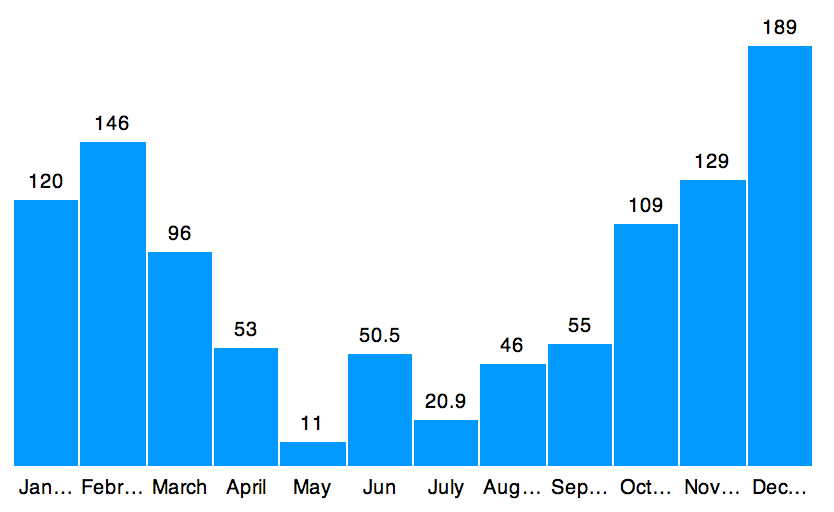

&lt;bar-graph&gt;
===========

Bar graph web component.

What is it ?
---------------

It's a web component that will take table data and create bar graph from them. In case that your browser don't support HTML imports users will still see table data.

Install with bower
------------------
`bower install bar-graph`

How to use
-----------

First import component
```html
    <link rel="import" href="webcomponent/bar-graph.html">
```
Then use bar graph as custom element like this:
```html
    <bar-graph></bar-graph>
```
Adding data
```html
    <bar-graph width="400" height="250" color="#4CC1DD">
        <table>
            <thead>
                <tr>
                    <th>month</th>
                    <th>value</th>
                </tr>
            </thead>
            <tbody>
                <tr>
                    <td>January</td>
                    <td>100</td>
                </tr>
                <tr>
                    <td>February</td>
                    <td>200</td>
                </tr>
            </tbody>
        </table>
    </bar-graph>
```

Options
-------
- width - graph width
- height - graph height
- color - bar colors
- show-values - if false bar values will not be shown
- show-titles - if false text below bars will not be shown
- offscreen-content - whether or not to hide the content off screen. You should set this to 'true' so users of screen readers can access the data, too.

Demo
----
[http://kopipejst.github.io/bar-graph/](http://kopipejst.github.io/bar-graph/)

Note
----

If your browser doesn't support HTML imports (which most browsers don't t this moment) this will not work. If it support you should see something this:



Accessibility
----

This web component is accessible. It places the bar graph in a `<figure>` element with a `role` of `image`.  If your `<table>` has a `<caption>` that will become the `<figcaption>` for the `<figure>` - akin, in this case, to the `alt` attribute.

For maximum accessibility, follow the following guidelines:

* make sure you have an informative `<caption>` on the data that holds your table.
* set the `offscreen-content` to "true". This doesn't hurt anything and sighted users don't even see it. So if you're just looking to display a bar graph, it totally won't hurt anything if you keep this set to "true"  
